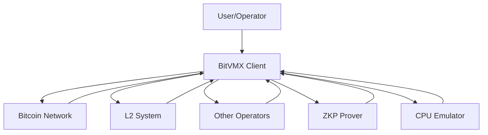
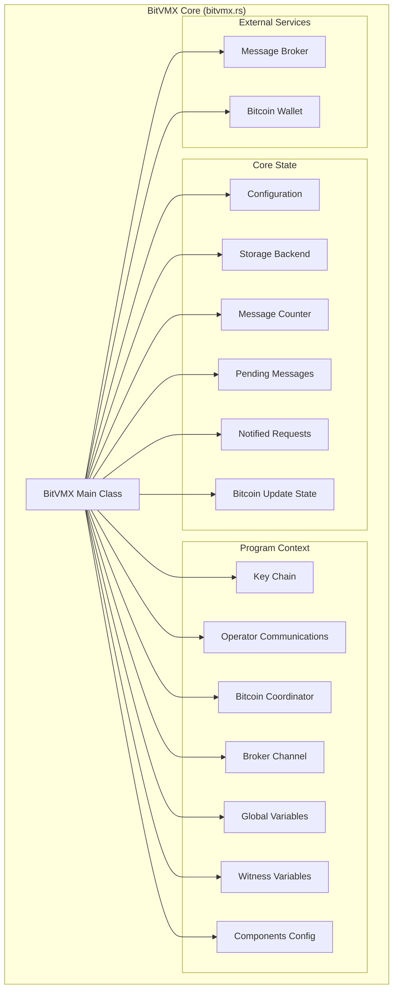
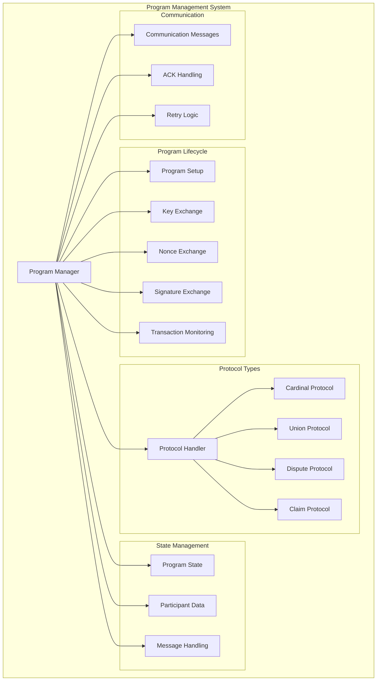
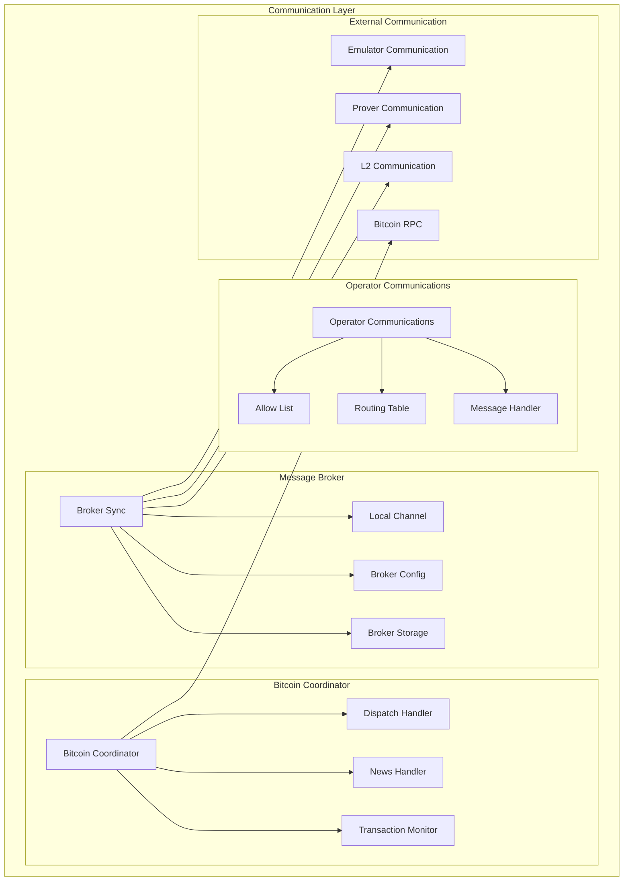

# BitVMX Client Architecture - C4 Diagram

## System Context Diagram

## Container Diagram

```mermaid
graph TD
    %% Main application entry point
    Main[Main Application<br/>main.rs]
    
    %% Core system components
    BitVMX[BitVMX Core<br/>bitvmx.rs]
    API[API Layer<br/>api.rs]
    Config[Configuration<br/>config.rs]
    
    %% Key management components
    KeyChain[Key Manager<br/>keychain.rs]
    Wallet[Bitcoin Wallet<br/>bitvmx-wallet]
    
    %% Communication components
    Comms[Operator Communications<br/>bitvmx-operator-comms]
    Broker[Message Broker<br/>bitvmx-broker]
    BitcoinCoord[Bitcoin Coordinator<br/>bitcoin-coordinator]
    
    %% Program management components
    Program[Program Manager<br/>program.rs]
    Protocol[Protocol Handler<br/>protocol_handler.rs]
    State[Program State<br/>state.rs]
    Variables[Variables & Witness<br/>variables.rs, witness.rs]
    
    %% Protocol implementation components
    Cardinal[Cardinal Protocol<br/>cardinal/]
    Union[Union Protocol<br/>union/]
    Dispute[Dispute Protocol<br/>dispute/]
    Claim[Claim Protocol<br/>claim.rs]
    
    %% Storage and utility components
    Storage[Storage Backend<br/>storage-backend]
    SPV[SPV Proof<br/>spv_proof.rs]
    Shutdown[Graceful Shutdown<br/>shutdown.rs]
    
    %% External systems
    BitcoinRPC[Bitcoin RPC<br/>bitvmx-bitcoin-rpc]
    ProtocolBuilder[Protocol Builder<br/>protocol-builder]
    KeyManager[Key Manager<br/>key-manager]
    JobDispatcher[Job Dispatcher<br/>job-dispatcher]
    CPUEmulator[CPU Emulator<br/>emulator]
    ZKPProver[ZKP Prover<br/>prover]
    
    %% Main flow connections
    Main --> BitVMX
    BitVMX --> API
    BitVMX --> Config
    BitVMX --> KeyChain
    BitVMX --> Wallet
    BitVMX --> Comms
    BitVMX --> Broker
    BitVMX --> BitcoinCoord
    BitVMX --> Program
    BitVMX --> Storage
    BitVMX --> SPV
    BitVMX --> Shutdown
    
    %% Program management flow
    Program --> Protocol
    Program --> State
    Program --> Variables
    
    %% Protocol implementation flow
    Protocol --> Cardinal
    Protocol --> Union
    Protocol --> Dispute
    Protocol --> Claim
    
    %% External system connections
    BitcoinCoord --> BitcoinRPC
    Protocol --> ProtocolBuilder
    KeyChain --> KeyManager
    API --> JobDispatcher
    JobDispatcher --> CPUEmulator
    JobDispatcher --> ZKPProver
```

## Component Diagram - BitVMX Core

## Component Diagram - Program Management

## Component Diagram - Communication Layer

## Key Components and Their Responsibilities

### Core Components

1. **BitVMX Core (bitvmx.rs)**
   - Main orchestrator of the system
   - Manages program lifecycle
   - Handles Bitcoin updates and wallet synchronization
   - Coordinates between all subsystems

2. **Program Manager (program.rs)**
   - Manages individual programs and their state
   - Handles key exchange, nonce exchange, and signature exchange
   - Manages participant data and communication
   - Implements retry logic and message handling

3. **Protocol Handler (protocol_handler.rs)**
   - Manages different protocol types (Cardinal, Union, Dispute, Claim)
   - Handles protocol-specific logic and state transitions
   - Manages protocol visualization and execution

### Communication Components

4. **Operator Communications (bitvmx-operator-comms)**
   - Handles P2P communication between operators
   - Manages allow lists and routing tables
   - Implements secure message exchange

5. **Message Broker (bitvmx-broker)**
   - Manages internal message routing
   - Handles communication with external services (L2, Prover, Emulator)
   - Implements message queuing and delivery

6. **Bitcoin Coordinator (bitcoin-coordinator)**
   - Monitors Bitcoin transactions and blocks
   - Handles transaction dispatch and status updates
   - Manages Bitcoin RPC communication

### Supporting Components

7. **Key Manager (keychain.rs)**
   - Manages cryptographic keys (ECDSA, Winternitz, RSA)
   - Handles key derivation and storage
   - Implements MuSig2 signature aggregation

8. **Storage Backend (storage-backend)**
   - Provides persistent storage for programs and state
   - Implements transaction support
   - Handles backup and recovery

9. **Bitcoin Wallet (bitvmx-wallet)**
   - Manages Bitcoin wallet operations
   - Handles address generation and transaction creation
   - Implements wallet synchronization

### External Dependencies

10. **Protocol Builder (protocol-builder)**
    - Builds and manages protocol definitions
    - Handles protocol visualization
    - Manages protocol execution context

11. **Job Dispatcher (job-dispatcher)**
    - Manages ZKP proof generation jobs
    - Coordinates with CPU emulator and ZKP prover
    - Handles job queuing and result processing

12. **Settings Manager (bitvmx-settings)**
    - Manages configuration loading and validation
    - Handles environment-specific settings
    - Provides configuration to all components

## Data Flow

1. **Initialization**: Main application loads configuration and initializes BitVMX core
2. **Program Setup**: Programs are created with participants and protocol types
3. **Key Exchange**: Participants exchange public keys for aggregated signatures
4. **Nonce Exchange**: Participants exchange nonces for MuSig2 signing
5. **Signature Exchange**: Participants exchange partial signatures
6. **Protocol Execution**: Protocols are built and signed
7. **Transaction Monitoring**: Bitcoin transactions are monitored for state changes
8. **Message Processing**: Incoming messages are processed and routed appropriately
9. **State Updates**: Program state is updated based on Bitcoin events and messages

## Key Features

- **Multi-Protocol Support**: Cardinal, Union, Dispute, and Claim protocols
- **Secure Communication**: P2P communication with allow lists and routing
- **Bitcoin Integration**: Full Bitcoin transaction monitoring and dispatch
- **Key Management**: Advanced cryptographic key management with MuSig2
- **State Persistence**: Robust storage backend with transaction support
- **Graceful Shutdown**: Coordinated shutdown of all components
- **Error Handling**: Comprehensive error handling and recovery
- **ZKP Integration**: Zero-knowledge proof generation and verification
