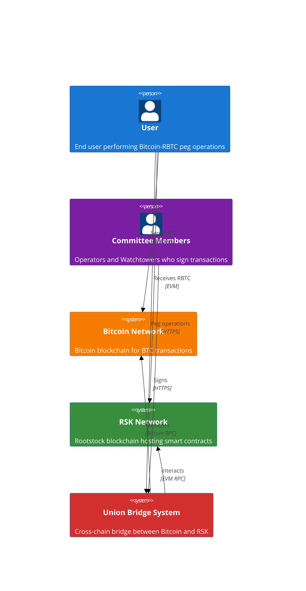
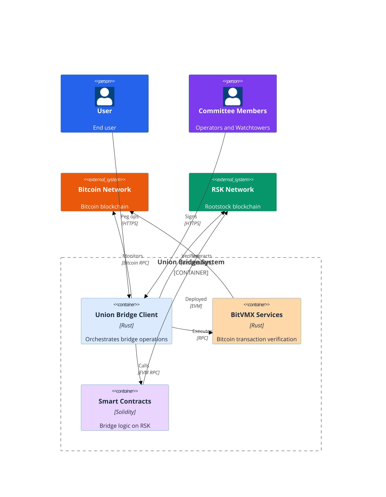
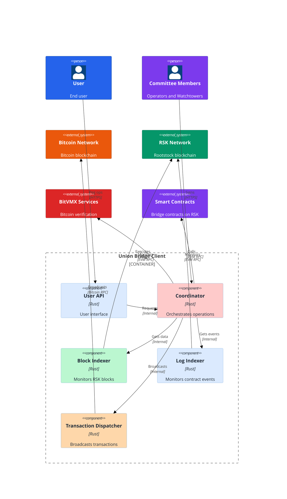
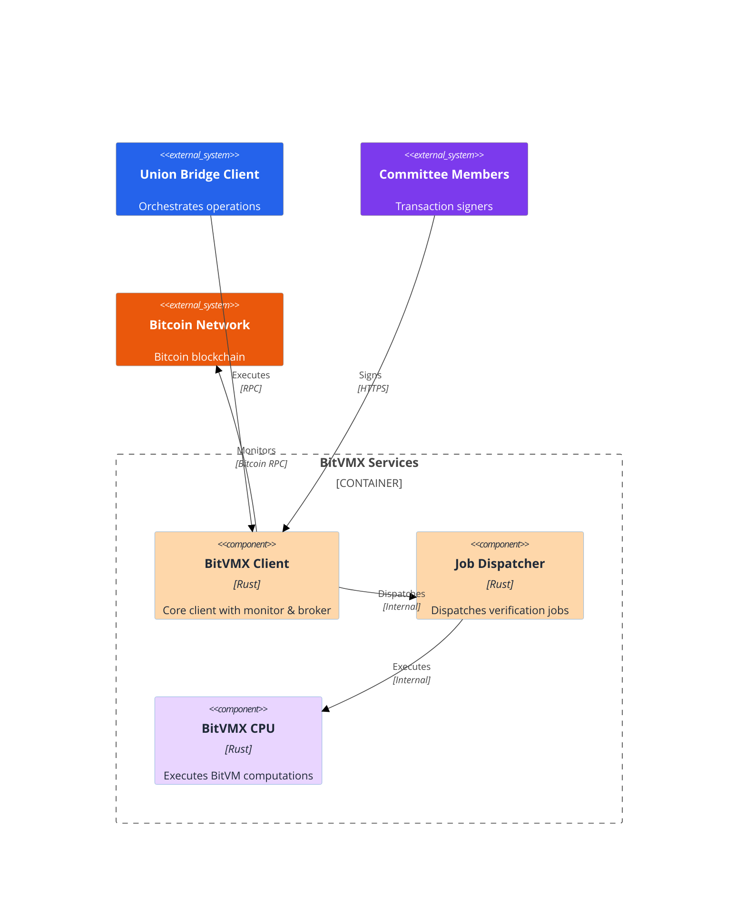
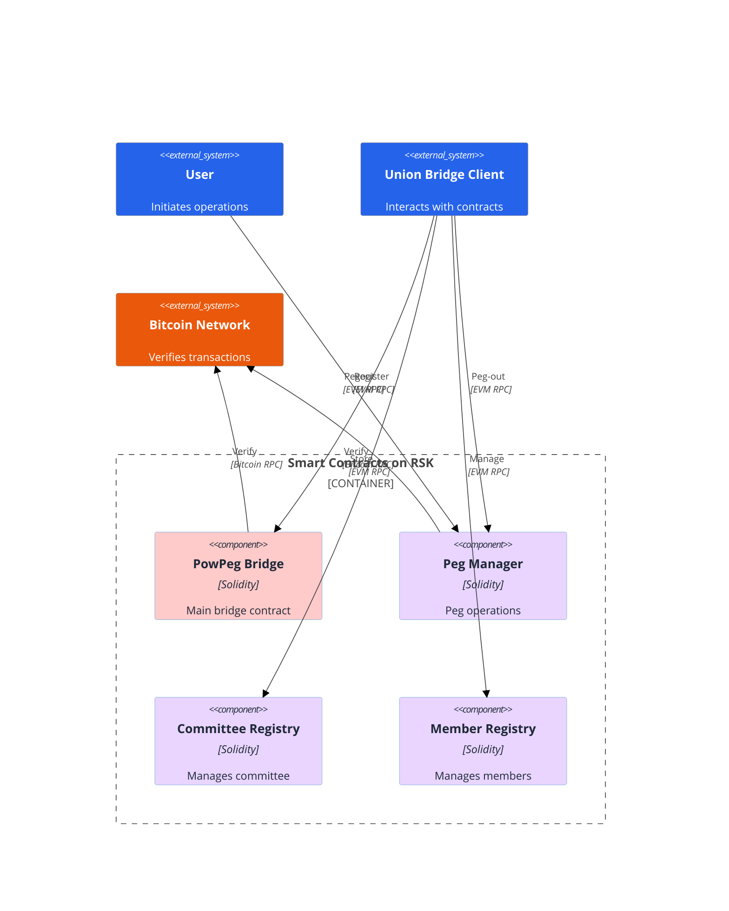
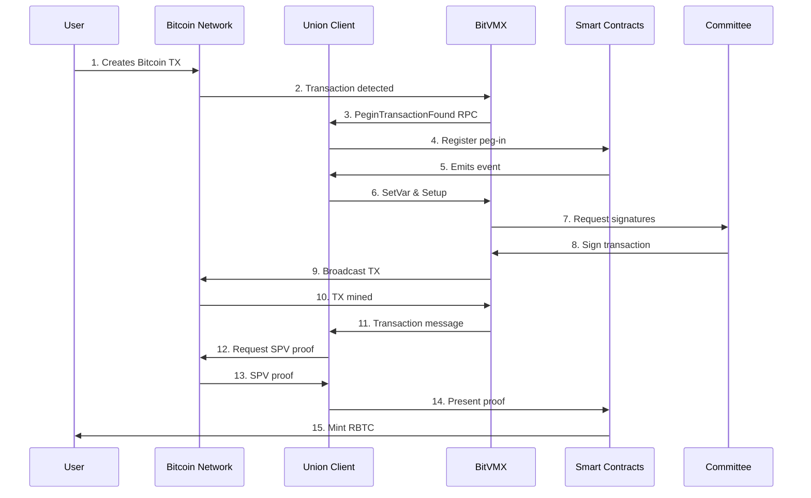
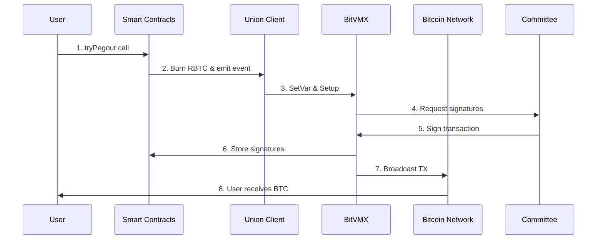
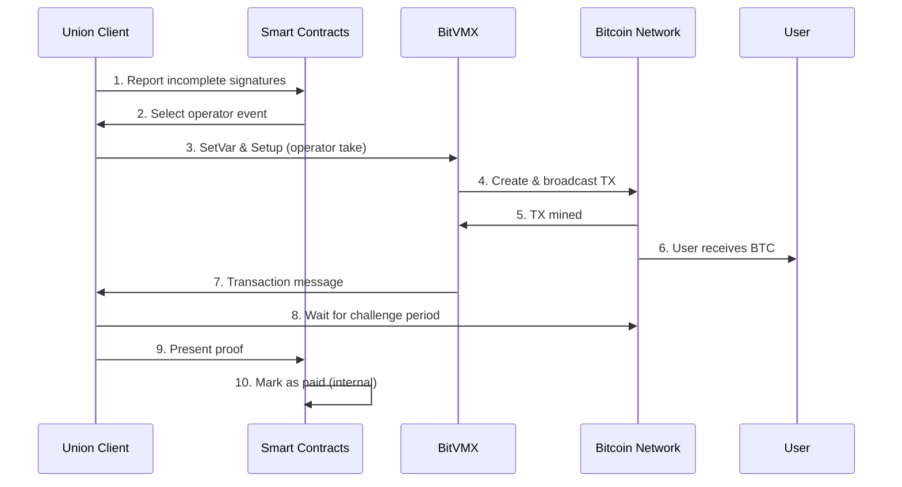

# Union Bridge Architecture - C4 Diagrams

## Level 1: System Context Diagram

## Level 2: Container Diagram

## Level 3: Component Diagram - Union Bridge Client

## Level 3: Component Diagram - BitVMX Services

## Level 3: Component Diagram - Smart Contracts

## Sequence Diagrams

### Peg-In Flow Sequence

### Peg-Out Flow Sequence (Optimistic - User take)

### Peg-Out Flow Sequence (Fallback - Operator take)

## Detailed Component Interactions

### Peg-In Flow

1. **User** creates Bitcoin transaction with OP_RETURN data and sends to **Bitcoind**
2. **BitVMX Monitor** (inside BitVMX Client) detects the transaction
3. **BitVMX Client** sends RPC message `PeginTransactionFound` to **Union Coordinator**
4. **Union Coordinator** registers peg-in in **PowPeg Bridge** smart contract (emits event)
5. **Union Coordinator** starts accept peg-in protocol in BitVMX:

   - Sends `SetVar` message to set variables
   - Sends `Setup` message to run the protocol

6. **Committee members** sign the accept peg-in Bitcoin transaction
7. **BitVMX Client** broadcasts signed transaction to **Bitcoind**
8. Once mined, **BitVMX Client** sends `Transaction` message to **Union Coordinator**
9. **Union Coordinator** requests SPV proof from **Bitcoind** and presents it to **PowPeg Bridge**
10. **PowPeg Bridge** validates the transaction and SPV proof, verifies it has enough confirmations, then mints RBTC to the user

### Peg-Out Flow (Optimistic Path - User Take)

1. **User** calls `tryPegout` on **Peg Manager** smart contract
2. **Peg Manager** burns RBTC and emits event
3. **Union Coordinator** picks up event and sends to **BitVMX Client**:

   - `SetVar` message to set variables
   - `Setup` message to start user take protocol (optimistic pegout)

4. **Committee members** sign the transaction:

   - **Union Coordinator** stores signatures in **Committee Registry**
   - If all committee members sign: **BitVMX Client** broadcasts transaction to **Bitcoind**
   - Once mined: **User** receives BTC

### Peg-Out Flow (Fallback Path - Operator Take)

1. If not all members sign after timeout:

   - **Union Coordinator** calls **Peg Manager** to report incomplete signatures
   - **Peg Manager** verifies not all signatures are present and selects operator to advance funds (emits event)

2. **Union Coordinator** listens to operator selection event and triggers BitVMX operator take protocol:

   - Sends `SetVar` and `Setup` messages

3. **Operator** creates Bitcoin transaction and sends funds to **User**
4. Once mined, **User** receives BTC
5. **BitVMX Client** sends `Transaction` message to **Union Coordinator**
6. **Union Coordinator** waits for challenge period
7. If no challenge, **Union Coordinator** presents proof to **Peg Manager** to mark as paid (internal smart contract operation)

## Key Components

### Core Infrastructure

- **Bitcoind**: Bitcoin node handling Bitcoin network operations
- **RSK**: Rootstock EVM-compatible blockchain hosting smart contracts

### Smart Contracts (on RSK)

- **PowPeg Bridge**: Main bridge contract handling RBTC minting/burning and Bitcoin transaction verification
- **Committee Registry**: Manages committee information and signatures
- **Member Registry**: Manages member information and registration
- **Peg Manager**: Manages peg-in/peg-out operations

### Union Bridge Client Services

- **Coordinator**: Orchestrates communication between Union and BitVMX
- **Block Indexer**: Monitors Rootstock blockchain blocks
- **Log Indexer**: Monitors smart contract events
- **User API**: Provides user-facing API interface
- **Transaction Dispatcher**: Handles transaction broadcasting

### BitVMX Services

- **BitVMX Client**: Core client with monitor and broker functionality
- **BitVMX Job Dispatcher**: Dispatches verification jobs
- **BitVMX CPU**: Executes BitVM computations

### Actors

- **User**: Initiates peg-in/peg-out operations
- **Committee Members**: Operators and Watchtowers who sign transactions
